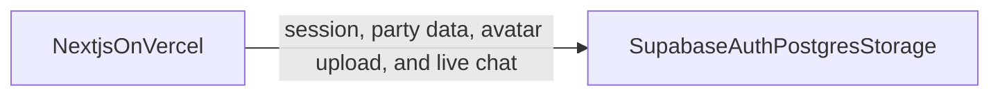
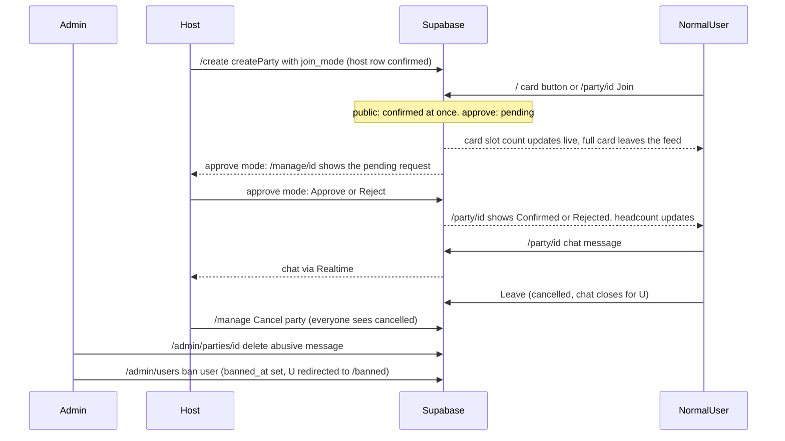

# MaTee implementation plan

Build the activity-party app described in [README.md](README.md) on the schema in [supabase/schema.sql](supabase/schema.sql). The repo has no app code yet.

**Stack:** Next.js App Router, React, Supabase (Auth, Postgres, and Storage), Vercel.

**Join rule:** each party has a `join_mode`, chosen by the host on `/create`.

- **Public** — the Join button inserts `party_members` as `confirmed` at once. No approval step. The capacity trigger still rejects a full party.
- **Approve** — the Request to join button inserts as `pending`. The host confirms or rejects on `/manage/[id]`.

Headcount is confirmed members only, including the host. A pending or confirmed member who is not the host can leave, which sets their row to `cancelled`. The host stays `confirmed`.




## Requirements checklist

From the “ต้องส่ง / ต้องมี” list in [README.md](README.md), and where each one lands:

- Supabase schema to submit — [supabase/schema.sql](supabase/schema.sql). Needs the changes listed in build step 2 (Schema) before it is final.
- Register — `/register`, Supabase Auth, profile row from the `handle_new_user` trigger.
- User image — avatar upload to the `avatars` bucket, saved on `profiles.avatar_url`.
- Login — `/login`, cookie session with `@supabase/ssr`.
- Session uses a JWT — Supabase's access token is the JWT. See “Session and JWT” below.
- Approve page — `/manage/[id]`, host confirms or rejects `pending` rows on approve-mode parties. Public parties show the member list only.
- Manage party — `/manage`, host sees status and counts, can cancel a party. Finished is automatic once the event time passes.
- Stage of headcount, confirm, cancel — `member_status` on `party_members`, counts from `parties.confirmed_count` and the `party_counts` view, capacity trigger in the database.
- At least 4 routes with a server/client split — 16 routes listed below. Home, categories, detail, manage, and admin pages are Server Components. The feed's live slot counts, chat, and forms are Client Components.

Added by the team after the proposal: live party chat, leave party, public/approve join modes, a global Admin role (dashboard, party and user moderation, chat moderation), a time-conflict lock (party duration plus a block on joining or creating overlapping parties), and a home feed at `/` with live slot counts. All are in the plan.

Accounts and settings needed outside this repo:

- A Supabase project. Run the schema there. Turn on Realtime for `parties` and `party_messages`. Decide whether email confirmation is on for register; off is simpler for a demo.
- A Vercel project linked to this repo, with the two Supabase env vars set.
- Supabase Auth redirect URLs for `localhost:3000` and the Vercel domain.

README items now out of date: section 1 and 2 describe a Tinder-style swipe deck on `/discover` (replaced by the card feed at `/`), section 2 says `/party/[id]` has comments (now chat), and section 5 (work split) is empty. Worth updating after the plan is agreed.

## Session and JWT

The session is a Supabase JWT. On login, Supabase Auth returns an access token (a signed JWT with `sub`, `email`, `role`, `exp`) and a refresh token. `@supabase/ssr` stores both in httpOnly cookies. No second token system is added.

Where the JWT is handled:

- `lib/supabase/server.ts` and `lib/supabase/client.ts` — server and browser clients that read the cookies.
- `middleware.ts` — runs on every request, refreshes an expired access token, redirects signed-out users away from `/create`, `/my-party`, `/manage`, and `/account`, and redirects a user whose `profiles.banned_at` is set to `/banned`.
- `lib/auth/get-session.ts` — server helper that verifies the JWT signature locally against the project's public JWKS and returns the claims plus `profiles.role`, so pages and Server Actions get the user id and role without a second round trip. Use it in every Server Action that writes. `requireAdmin()` wraps it and calls `notFound()` when the role is not `admin`.
- Every Supabase query carries the JWT in the `Authorization` header, which is how Row Level Security knows `auth.uid()`. Realtime uses the same token for the chat subscription.

For the demo, a small `/account` panel shows the decoded claims (`sub`, `email`, `exp`) so the JWT-based session is visible.

Supabase project setting: use asymmetric signing keys (JWT Signing Keys) so local verification works. Rotate nothing else.

## Image upload

Supabase Storage holds profile photos. [supabase/schema.sql](supabase/schema.sql) already creates a public `avatars` bucket and limits each user to `avatars/{userId}/`.

The signed-in browser uploads with the Supabase client. Storage policies check `auth.uid()`. After upload, save the public object URL on `profiles.avatar_url`. Allow jpeg, png, and webp, and cap the file at 2 MB. `next/image` needs a remote pattern for the Supabase storage host.

## Party status

A party is `open`, `cancelled`, or finished.

- **Cancel** is the host's only status button, on `/manage`. It sets `parties.status = 'cancelled'`. The party leaves the feed (live, through the `parties` Realtime channel), no one can request to join, and the party page says the host cancelled it. Members keep the chat open so they can read the notice and talk. Cancel is one-way.
- **Finished** is not a button and is not written to the database. A party is finished when `event_date + event_time` is in the past. The feed only shows open parties whose event time is still ahead. The party page and `/my-party` label past parties as finished. Drop the `completed` value from `party_status` in the schema so nothing depends on it.
- The "users request to join" policy gains an `event_date + event_time > now()` check so a finished party rejects late requests at the database too.

Per-person status (approve, reject, leave) lives on `party_members.status` and is separate from this.

## Leave party

`leaveParty(partyId)` sets that user's `party_members.status` to `cancelled`. It is the same action for a pending request and a confirmed member. The host has no Leave button; cancelling the whole party stays on `/manage`. The existing trigger still rejects a host row that is not `confirmed`.

Leaving removes that person from the headcount when they were confirmed, and it closes the chat for them immediately: unsubscribe from Realtime, hide the transcript and the composer, and show “You left this party.” People who stayed can still read older messages from the person who left. The leaver cannot read or send after that, including on reload.

Because `party_members` is unique per user and party, joining again updates that same row from `cancelled` back to `pending` (approve mode) or `confirmed` (public mode) when the party is `open` and not full. Chat access returns as soon as that row exists. A `rejected` row stays closed until the host changes it. Rejoining runs the time-conflict check again, like a first join.

## Time conflicts

Every party has a duration. The host picks `duration_minutes` on `/create` (30 to 480, step 30, default 120). Start is `event_date + event_time`; end is start plus the duration. Cards and `/party/[id]` show both, for example `18:00–20:00`. Finished (see Party status) keeps using the start time.

**Rule.** A user cannot join, request, or create a party whose `[start, end)` interval overlaps a party where they already have an active commitment. An active commitment is a `party_members` row with status `pending` or `confirmed` (this includes parties the user hosts, because the host row is `confirmed`) on a party with status `open` whose end time is in the future. `cancelled` and `rejected` rows, and `cancelled` or finished parties, do not count. Touching intervals, where one ends exactly when the other starts, are not a conflict.

Overlap test for two intervals `a` and `b`: `a.start < b.end and b.start < a.end`.

```
              12:00   13:00   14:00   15:00   16:00
Overlap:   A  [=============)
           B          [=============)              -> conflict (13:00 < 14:00 and 12:00 < 15:00)
Overlap:   C  [=====================)
           D          [=====)                      -> conflict (D sits inside C)
Touching:  E  [=============)
           F                  [=============)      -> no conflict (E.end == F.start)
Touching:  G                  [=====)
           H  [==============)                     -> no conflict (H.end == G.start)
```

**Enforcement, three layers. The database is the source of truth.**

- **Database.** `parties.duration_minutes integer not null default 120 check (duration_minutes between 30 and 480)`. A function `public.has_time_conflict(p_user uuid, p_party uuid) returns boolean` (plus a variant that takes `p_start timestamptz, p_end timestamptz, p_exclude_party uuid` so `parties` can use it before a row exists) that selects from `party_members` joined to `parties` where `user_id = p_user`, member status in (`pending`, `confirmed`), party status `open`, party end `> now()`, `party_id <> p_exclude_party`, and the overlap test above holds. A `BEFORE INSERT OR UPDATE OF status` trigger on `party_members` calls it when `new.status` is `pending` or `confirmed` and raises `exception 'Time conflict'`. A `BEFORE INSERT` trigger on `parties` runs the same check for `new.owner_id` against the new start and end, so a host cannot create a party on top of their own commitments. Index `party_members (user_id, status)` already exists and covers the lookup.
- **Server Actions.** `joinParty` and `createParty` call the check first (an RPC to `has_time_conflict`, or a select of the user's active commitments with the same test) and return a typed error `{ code: 'time_conflict', conflictingPartyId, conflictingTitle }` so the UI can name the other party. If the trigger still fires (a race), map the `Time conflict` message to the same error shape.
- **UI.** On the feed card and `/party/[id]`, when the viewer is signed in, the action button is disabled with the label "ชนเวลากับ “[title]”", and the title links to `/party/[conflictingPartyId]`. The feed fetches the user's active commitments once (party id, title, start, end) and keeps them fresh through the existing `parties` Realtime subscription, so the check is instant on the client; the server is still the source of truth and the action's error wins. `/create` validates the date, time, and duration with zod against the same commitments list and shows the conflict inline on the date/time fields, with the same message. Guests never see a conflict state.

## Party chat

Replace the `comments` table in [supabase/schema.sql](supabase/schema.sql) with `party_messages` (`id`, `party_id`, `user_id`, `body`, `created_at`). `body` stays 1–500 characters. There is no separate comment thread. Add the table to the `supabase_realtime` publication.

Only a user whose `party_members` row for that party is `pending` or `confirmed` can read and send. Guests, people who have not joined, people who left, and people who were rejected see the party details without the transcript. Guests get a login prompt. Signed-in users who are not in the party get a join prompt.

The party page loads the latest messages on the server for someone still in the party. A client panel subscribes to inserts and shows new messages without a refresh. `sendPartyMessage` checks the session and an active membership, inserts the row as `auth.uid()`, and Realtime updates everyone else still in the chat. Each message shows the sender's avatar, display name, and time. A user can delete only their own message, and only while they are still in the party. The host can delete any message in their own party's chat. An admin can delete any message in any party (see Roles).

## Roles

Two per-party roles, decided by `parties.owner_id`, and one global account role, stored on `profiles.role`:

- **Host** — the person who created the party. Approves or rejects requests, cancels the party, always counts as confirmed, cannot leave. Can delete any message in their own party's chat.
- **Normal user** — anyone else. Browses the feed, joins or requests to join, leaves, and chats once pending or confirmed.
- **Admin** — a global role. `profiles.role` is the enum `user_role` (`user`, `admin`), default `user`, set by hand in the Supabase table editor. There is no UI to promote a user. An admin can:
  - Moderate parties: view every party, including cancelled and finished ones; cancel or delete any party.
  - Manage users: list all users; ban or unban an account. Ban sets `profiles.banned_at timestamptz null`. A banned user cannot get past middleware (redirected to `/banned`), cannot write, and their parties are hidden from feeds.
  - Moderate chat: read any party's chat and delete any message.
  - Dashboard: totals for users, parties (open, cancelled, finished), joins, and messages, plus recent signups.

The same account is host of its own parties and a normal user in everyone else's. The app decides which buttons to show by comparing the session `sub` claim with `owner_id`. Row Level Security enforces the same split in the database.

Admin enforcement:

- `getSession()` also loads `profiles.role`. `requireAdmin()` is a server helper that returns the session or calls `notFound()`; every `/admin` page and admin Server Action starts with it. Nav shows the Admin link only when the role is `admin`.
- SQL function `public.is_admin()` returns `select role = 'admin' from profiles where id = auth.uid()`. Admin policies use it: select, update, and delete on `parties`; select on all `party_members`; select and delete on `party_messages`; select and update on `profiles` (for `banned_at`).
- Host delete-message policy: the owner of the party can delete any `party_messages` row in that party.
- Middleware redirects a user with `banned_at` set to `/banned`. Write policies also check `banned_at is null` on the caller's profile so a stale session cannot write.




## Home feed

`/` is the discover feed. There is no separate `/discover` or `/parties`; `/discover` redirects to `/` so the README link still works. The swipe deck is gone. The feed is a vertical list of party cards, newest first, showing every open party whose event time is ahead and that still has a free slot.

Card layout, top to bottom:

```
[ host avatar ] [ host display name ]
[ Title ]
[ Details: date + time · location (link to Google Maps search) · slots  confirmed/max  (live) ]
[ Category badge ]  [ Public or Approve badge ]
[ Action button ]
```

- **Host row** — avatar from `profiles.avatar_url` with a default when empty, and `display_name`. Tapping opens nothing in this version.
- **Title** — links to `/party/[id]`.
- **Details** — `event_date` in Thai format and the start–end time from `event_time` and `duration_minutes`, for example `18:00–20:00`; `location` as text and a link to `https://www.google.com/maps/search/?api=1&query=<location>`; slots as `confirmed/max`, for example `3/4`.
- **Badges** — category (กีฬา, บอร์ดเกม, ติวสอบ, คาเฟ่, อื่นๆ) and join mode.
- **Action button** — depends on who is looking:
  - Guest: "เข้าสู่ระบบเพื่อเข้าร่วม" opens the login sheet and returns to `/` after.
  - Normal user, not in the party: "เข้าร่วม" (public) or "ขอเข้าร่วม" (approve). Disabled with "เต็มแล้ว" if the count reached max between render and click. Disabled with "ชนเวลากับ “[title]”" (title linking to that party) when the party overlaps one of the user's active commitments; see Time conflicts.
  - Normal user, pending: "รอการยืนยัน" with a small "ยกเลิก" that calls `leaveParty`.
  - Normal user, confirmed: "เข้าร่วมแล้ว" with a small "ออก" that calls `leaveParty`.
  - Host: "จัดการ" linking to `/manage/[id]`.
  - A small text link "ข้าม" under the button hides the card and writes to `skips` (signed-in only). Hidden parties come back only from `/my-party`.

Search and filters sit above the feed: a search box on title and location, category chips, and a Public or Approve filter. They live in the URL (`?q=&category=&mode=`) so a link can be shared. The first 20 cards render on the server; a "โหลดเพิ่ม" button fetches the next 20. Cards the signed-in user has skipped are excluded on the server.

## Live slot counts

The slot number on every card updates without a refresh, and a card leaves the feed the moment the party fills. When a confirmed member leaves a full party, the card comes back.

Design:

- Add `parties.confirmed_count integer not null default 0`. A trigger on `party_members` (insert, update of status, delete) recomputes it for the affected party. This replaces `current_members` from the `party_counts` view for the feed and cards; the view keeps `pending_count` for `/manage`.
- Enable Realtime on `parties`. It is readable by `anon`, so guests get updates too. `party_members` stays off Realtime.
- The feed is a Client Component that receives the server-rendered first page and subscribes to `postgres_changes` on `parties` for `UPDATE` events, with no status filter so a cancel also arrives. On each event:
  - If the party is in the list: update `confirmed_count`; if `confirmed_count >= max_members` or `status` is not `open`, remove the card.
  - If the party is not in the list, `status = 'open'`, `confirmed_count < max_members`, and the event time is ahead: fetch that one party and insert it at its position by `created_at`. This is the "someone left a full party" path.
- The feed query uses the same rule on the server: `status = 'open' and confirmed_count < max_members and event_date + event_time > now()`.
- `/party/[id]` subscribes to the same channel for one row and updates `confirmed/max` live.
- The action button also reacts: a Join click on a card that just filled gets the database "Party is full" error and the button flips to "เต็มแล้ว" instead of a stale success.

## Routes

**Guest (not signed in)**

Read-only preview. Anything that writes or depends on who you are asks for login.

- `/` — the card feed described above. Search and filters work. Action button is "เข้าสู่ระบบเพื่อเข้าร่วม". No skip.
- `/discover` — redirects to `/`, keeping `?category=`.
- `/categories` — static category grid. Choosing one goes to `/?category=`.
- `/party/[id]` — the same card fields in full, including start and end time, plus `detail` text. No member list and no chat. A "Log in to join" button sits where Join would be. Slot count is live. No conflict state for guests.
- `/login` and `/register` — Supabase Auth. Register collects display name and an optional avatar.

`/create`, `/my-party`, `/manage`, and `/account` redirect a guest to `/login?next=` and return them after they sign in. In the database, `anon` can read `parties` and `profiles` only; `party_members`, `skips`, and `party_messages` need a signed-in user.

**Normal user (signed in)**

- `/` — same feed with the per-user action button and the "ข้าม" skip link. Parties the user has skipped are excluded; parties the user hosts or already has a row in stay visible with the matching button state. Cards that overlap one of the user's active commitments stay visible with the disabled "ชนเวลากับ “[title]”" button, checked client-side from the user's commitments list.
- `/party/[id]` — start and end time, Join or Request to join depending on mode, Leave, request status (pending, confirmed, rejected), the member list, and the live chat while pending or confirmed. The Join button is disabled with "ชนเวลากับ “[title]”" (linked) when the party overlaps an active commitment; `joinParty` returns the `time_conflict` error if the client check was stale. Chat updates through Realtime and closes when that user leaves.
- `/my-party` — parties I requested or joined, parties I left, and skips.
- `/account` — profile, avatar change, and the decoded JWT claims.
- `/banned` — where middleware sends a signed-in user whose `profiles.banned_at` is set.

**Host (signed in, own parties only)**

- `/create` — react-hook-form + zod, including a join mode choice: Public (anyone joins right away) or Approve (I confirm each person). Category is the fixed `party_category` enum; when the host picks `other`, a `custom_category` text field appears (1–30 chars, required in that case) and is shown in place of the category label on cards and detail. A `duration_minutes` field (30 to 480, step 30, default 120) sets the end time. Zod checks the date, time, and duration against the host's own active commitments and shows "ชนเวลากับ “[title]”" inline on the date/time fields. Server Action `createParty` runs the same check first and returns `{ code: 'time_conflict', conflictingPartyId, conflictingTitle }` on overlap; the `parties` insert trigger is the last line. Then revalidate `/`. Creating a party makes the user its host.
- `/manage` — my parties: open, cancelled, or finished, join mode, confirmed count, pending count (approve mode), and a Cancel party button on open parties.
- `/manage/[id]` — approve or reject pending people on an approve-mode party; member list on a public party. Returns 404 for a party the user does not own.
- `/party/[id]` — the host sees the headcount, the member list, and the chat, but no Join or Leave button. A "Manage requests" link goes to `/manage/[id]`.

**Admin (signed in, `profiles.role = 'admin'`)**

Every page below calls `requireAdmin()` first; non-admins get 404. Pages are Server Components; the action buttons are small Client Components calling admin Server Actions.

- `/admin` — dashboard: totals for users, parties (open, cancelled, finished), joins, and messages, plus a recent signups list.
- `/admin/parties` — every party, including cancelled and finished, with search and status/category filters. Cancel or delete any party.
- `/admin/users` — every user with display name, role, join date, and ban state. Ban or unban an account.
- `/admin/parties/[id]` — party details plus the full chat transcript, with a delete button on every message.

Nav is a Server Component and shows an Admin link only when `profiles.role = 'admin'`. Forms, the live feed, and join/leave buttons are Client Components. Writes go through Server Actions.

## Build order

1. **Scaffold.** Next.js App Router, TypeScript, `@supabase/supabase-js` and `@supabase/ssr`, `react-hook-form`, `zod`. No gesture library; the swipe deck is gone. Env example for `NEXT_PUBLIC_SUPABASE_URL` and `NEXT_PUBLIC_SUPABASE_ANON_KEY`. `next.config` image remote pattern for the Supabase storage host.
2. **Schema.** In [supabase/schema.sql](supabase/schema.sql): add enum `party_join_mode` (`public`, `approve`) and `parties.join_mode not null default 'approve'`; change the "users request to join" policy so the inserted status must be `confirmed` when the party is public and `pending` when it is approve; allow a user to move their own `cancelled` row back to that same status; replace `comments` with `party_messages` readable and writable only by `pending` or `confirmed` members; drop `completed` from `party_status`; add the event-time check to the join policy; add `parties.confirmed_count` with its trigger; enable Realtime on `parties` and `party_messages`. Roles and moderation: add enum `user_role` (`user`, `admin`) and `profiles.role not null default 'user'`; add `profiles.banned_at timestamptz null`; add `parties.custom_category text null` with a check that it is 1–30 chars and present exactly when `category = 'other'`; add `public.is_admin()`; add admin policies (select/update/delete on `parties`, select on all `party_members`, select/delete on `party_messages`, select/update on `profiles`); add the host delete-message policy on `party_messages`; add `banned_at is null` to the write policies. Time conflicts: add `parties.duration_minutes integer not null default 120 check (duration_minutes between 30 and 480)`; add `public.has_time_conflict(p_user uuid, p_party uuid) returns boolean` and its start/end variant; add the `BEFORE INSERT OR UPDATE OF status` trigger on `party_members` and the `BEFORE INSERT` trigger on `parties` that raise `'Time conflict'` (see Time conflicts). Apply the SQL, including the `avatars` bucket.
3. **Auth and profile.** Email register and login. Session is the Supabase JWT in httpOnly cookies, refreshed in `middleware.ts` and verified in `getSession()`. Profile row comes from the existing `handle_new_user` trigger. Avatar upload goes to Supabase Storage and updates `profiles.avatar_url`. Protect `/create`, `/my-party`, `/manage`, `/account`, and all writes. `/` and `/party/[id]` stay open to guests in read-only form.
4. **Parties.** Create, the card feed at `/` with search and filters, category page, and party detail. Slot counts come from `parties.confirmed_count`; pending counts from the `party_counts` view.
5. **Chat.** Live message panel on `/party/[id]` for pending and confirmed members. Everyone else sees a login or join prompt instead of the transcript.
6. **Membership.** Request, leave, skip, and request again after leaving. Leaving sets `cancelled` and closes that user's chat. Host approve/reject and Cancel party stay on `/manage`. Finished is derived from the event time. Capacity, “host stays confirmed”, and the time-conflict lock stay in the database triggers. `joinParty` and `createParty` run the conflict check first and return `{ code: 'time_conflict', conflictingPartyId, conflictingTitle }`; the feed, `/party/[id]`, and `/create` show the disabled "ชนเวลากับ “[title]”" state from the user's commitments list (fetched once, refreshed by the `parties` Realtime channel). Test the two overlapping and two touching cases from the Time conflicts section.
7. **Admin.** `requireAdmin()` helper, Admin nav link, `/banned` page and the middleware redirect. `/admin` dashboard counts, `/admin/parties` list with cancel and delete, `/admin/users` list with ban and unban, `/admin/parties/[id]` chat transcript with delete message. Host delete-message button on `/party/[id]`. Hide banned users' parties from the feed query.
8. **Live slots.** Realtime subscription on `parties` in the feed and on `/party/[id]`. Card removed when full or cancelled, re-inserted when a slot opens. Button flips to "เต็มแล้ว" on a late click.
9. **Production.** Vercel project, env vars, Supabase Auth redirect URLs for the production domain. Smoke-test register, avatar, create, join until full in a second browser and watch the card disappear, leave and watch it return, approve, and a chat message that the remaining member can see after the other member has left.

## Suggested split

- Person A: scaffold, Supabase clients, auth, avatar upload.
- Person B: home feed cards, search and filters, detail, create, live chat.
- Person C: manage/approve, live slot counts, my-party, admin pages (dashboard, party and user moderation, chat moderation), Vercel deploy.

